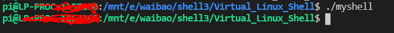
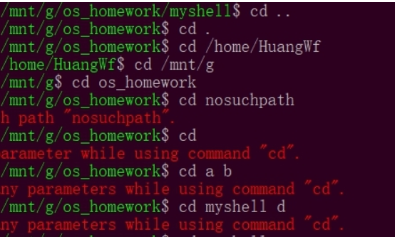
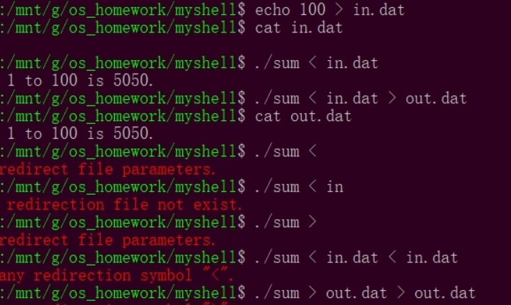
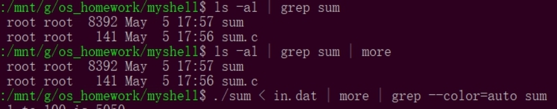
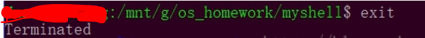

### 一、介绍

这个是模拟linux 终端的一个shell脚本，能实现cd、ls、 重定向(> 、>>、< 、<<)、管道等linux常用命令

### 二、使用方法

1、在命令行处执行*make*命令进行编译，编译成功以后运行*./myshell*来运行系统

2、运行以后模拟username@hostname，以绿色方式呈现

### 三、使用示例

- [x] 输出、入重定向(>、< 、>>、<<)
- [x] 多重管道
- [x] cd
- [x] exit退出系统

**1、执行cd指令**

**2、执行重定向**

**3、执行管道**

**4、退出系统**

### 四、代码详解

请参考我的Blog